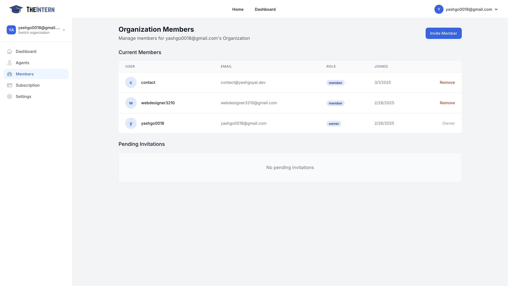

#  Add Organization Members

This screen shows who has access to your organization's dashboard and what roles they have (e.g., owner, member).

### What You Can Do Here
- **View Current Members**: See each user's email address, their assigned role, and the date they joined.
- **Remove Members**: Revoke access to someone who no longer needs it.
- **Invite New Members**: Add colleagues or collaborators so they can manage Agents, logs, or other settings.

### How to Use It
- Check Roles to ensure each person has the appropriate level of access (owner vs. member).
- Remove users who are no longer on the project.
- Invite Members by clicking "Invite Member" and entering their email address. They'll receive an email with further instructions.

