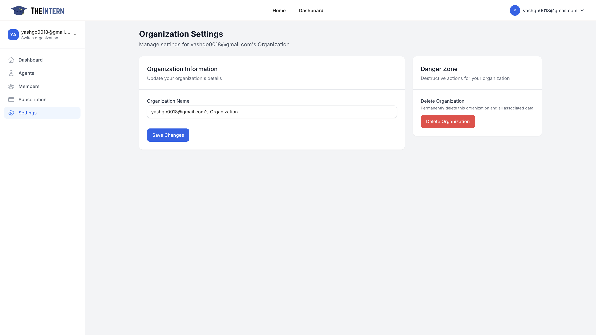
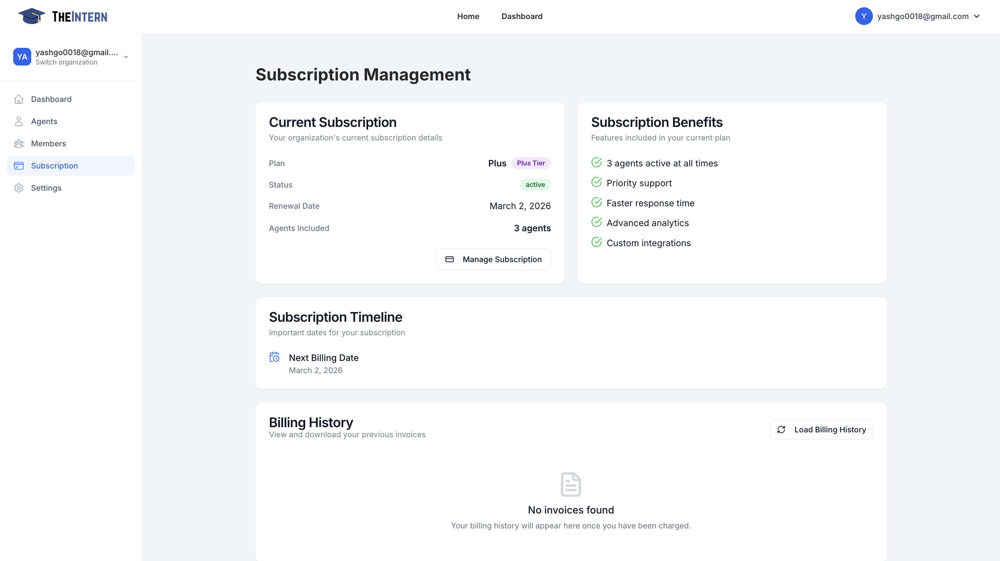

# Manage My Organization

The Organization Management section provides tools to control your organization's settings and manage team members who have access to your dashboard.

Here you manage organization-level details, such as your organization name. You also have access to a "Danger Zone" for deleting your entire organization and all associated data.

### What You Can Do Here
- **Rename Your Organization**: Change the display name that appears throughout the dashboard.
- **Delete Organization**: Permanently remove the organization's data (irreversible).

### How to Use It
- **Update Organization Name**: Helpful if your company rebrands or you want a more descriptive label.
- **Use the Danger Zone Carefully**: This action cannot be undone. Make sure you truly want to delete all agents, logs, and data before proceeding.

# Manage My Subscription
Udpate your subscription.

