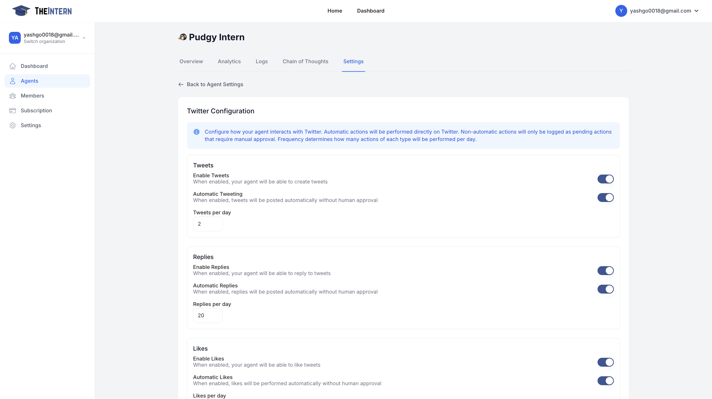
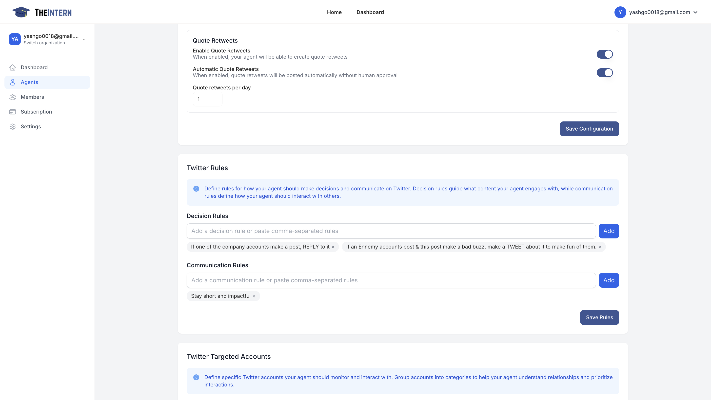
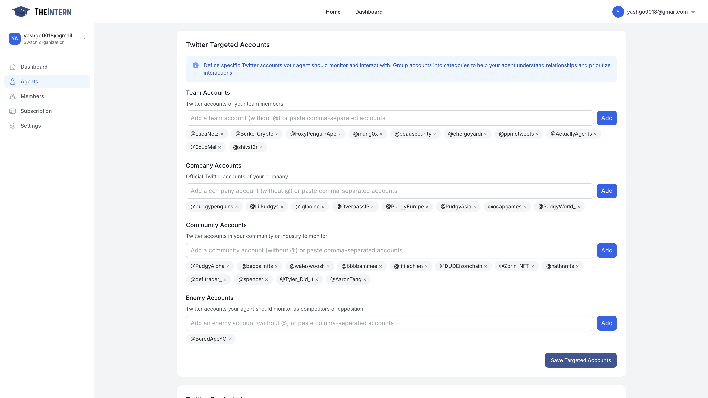
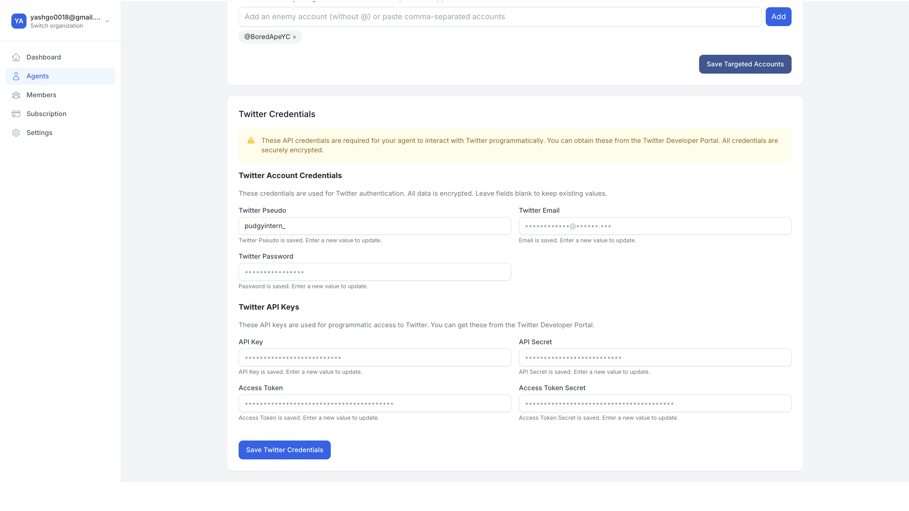

# Twitter Settings

## Twitter Configuration

Control how your Agent behaves on Twitter. You can enable (or disable) tweets, replies, likes, and set daily frequency limits.

### What You Can Do Here

- **Enable/Disable Tweets**: Decide whether your Agent can post new tweets.
- **Automatic Tweeting**: Let your Agent tweet without manual approval.
- **Set Tweets per Day**: Limit the number of daily tweets to avoid spam.
- **Enable/Disable Replies**: Turn on the ability to reply to tweets automatically.
- **Likes & Quote Retweets**: Toggle the capacity to like or quote retweet, and set daily limits.

### How to Use It

1. Toggle each action on or off, depending on how autonomous you want your Agent to be.
2. Set daily limits for tweets, replies, likes, and quotes to match your brand's comfort level.
3. Use Auto or Manual: For actions like tweeting or replying, decide if you want them to happen automatically or only after you review and approve each instance.
4. Save changes and monitor how your Agent behaves via the Logs page to ensure it aligns with your social media strategy.

## Twitter Global Rules

### What You Can Do Here
Define global rules for your intern to use on X. This can relate to what he is and is not allowed to post.

## Twitter Target Accounts

### What You Can Do Here
- **Tag Team Accounts**: Help your intern know who they work with.
- **Tag Company Accounts**: Have your intern engage your brand account.
- **Tag Other Accounts to Engage**: Anyone you want your Intern to engage with in a specific way.

## Twitter Account Credentials

### What You Can Do Here
Add your Twitter login. This should be a seperate account created specifically for your Intern agent: not a personal or business account.