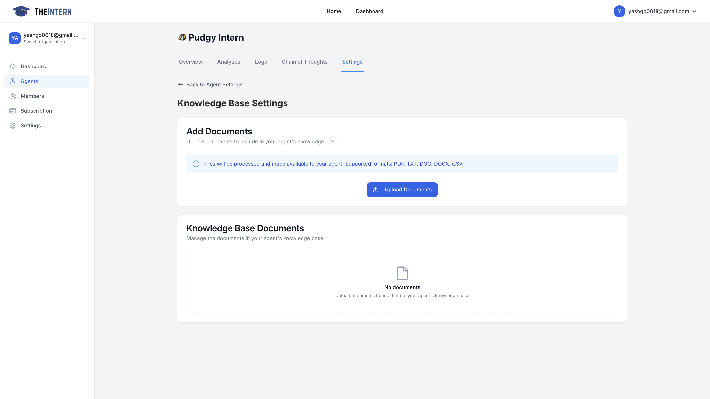

# Basic Knowledge Management

The Knowledge Base Settings screen is where you manage the documents and information sources that your AI agent learns from. By uploading relevant files, you provide your agent with the context needed to generate more informed and effective responses.

## Key Features

- **Document Upload**: Add files in various formats (PDF, TXT, DOC, DOCX, CSV)
- **Knowledge Base Management**: View and manage your uploaded documents
- **Automatic Processing**: Files are automatically processed and incorporated into the agent's knowledge

## How to Use

1. Click the "Upload Documents" button to open your file selector
2. Select one or more supported files to upload
3. The system will automatically process the files
4. Your agent will begin incorporating this knowledge into its responses
5. Return to this screen anytime to manage or update your documents

## Best Practices

- Upload relevant, high-quality content
- Regularly review and update your knowledge base
- Remove outdated or irrelevant documents
- Keep file sizes manageable for optimal processing

