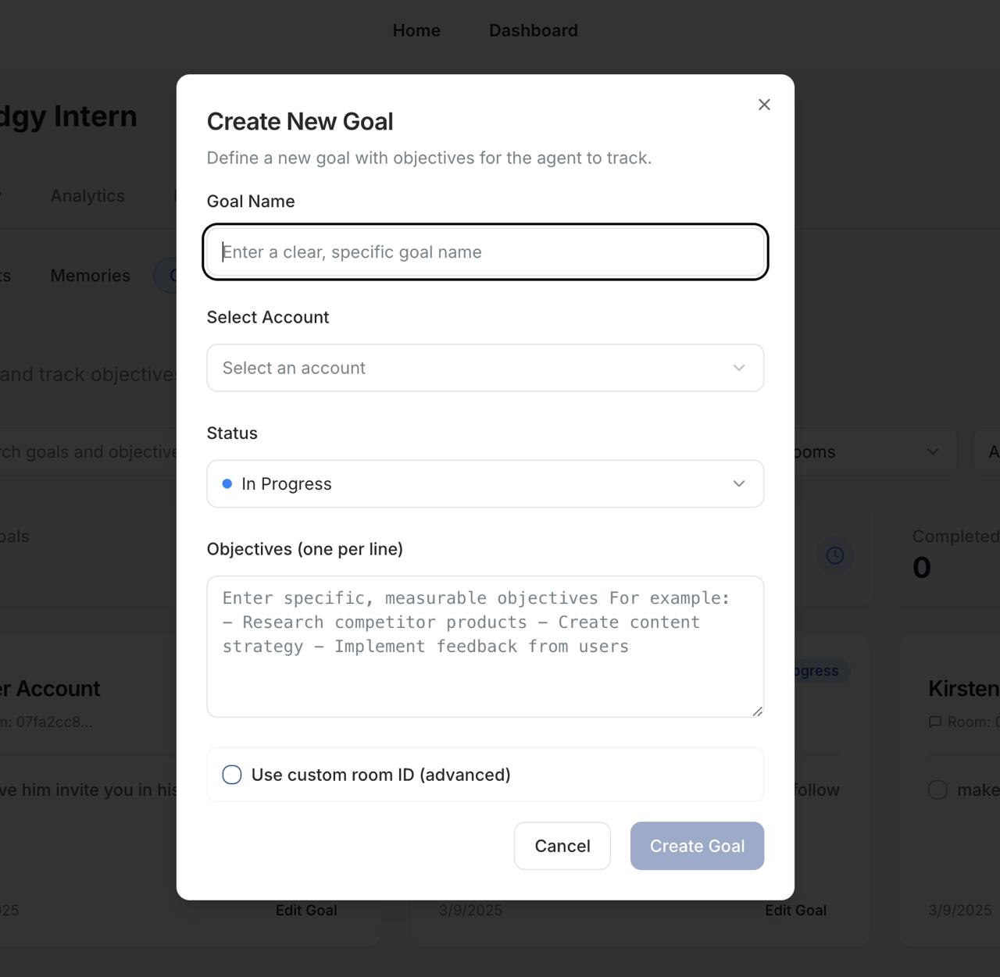

# Create Engagement Goals for Specific Accounts

The Goals section enables you to set and track specific objectives for your AI agent's interactions with target accounts. This helps maintain focused and strategic engagement with important accounts.

## Goal Management

### Key Features
- **Goal Overview**: Track total goals, progress, and completion status
- **Goal Cards**: View individual goals with objectives and status
- **Account Association**: Link goals to specific target accounts

### Creating New Goals

1. Click the "New Goal" button
2. Provide a clear goal name
3. Select the target account
4. Set the goal status
5. List specific objectives
6. (Optional) Add custom room ID

## Best Practices

- Set clear, measurable objectives
- Regularly review goal progress
- Update goals based on performance
- Align goals with overall strategy

